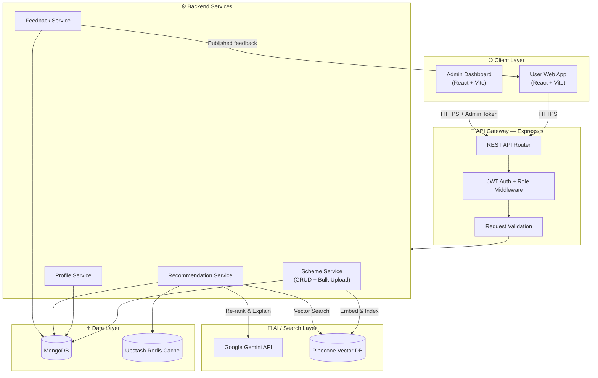
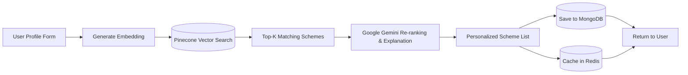
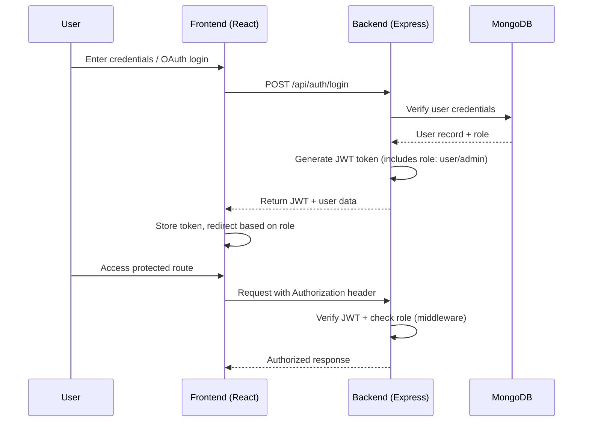
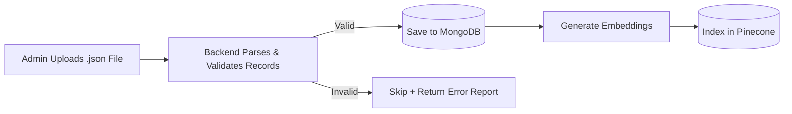
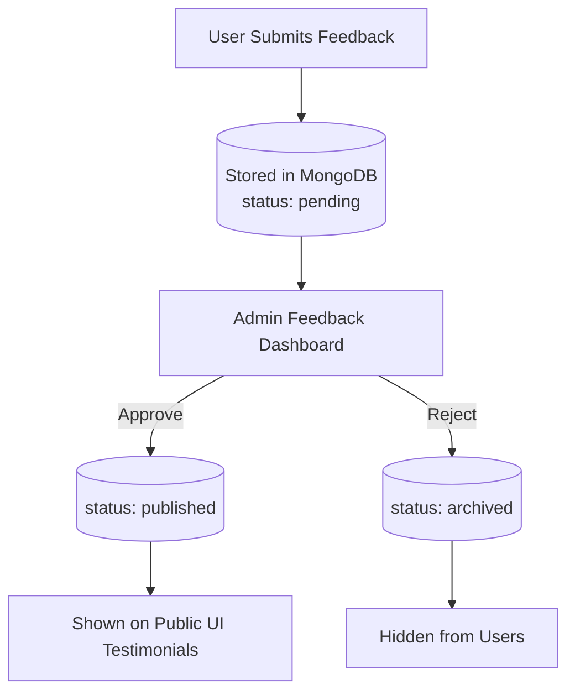
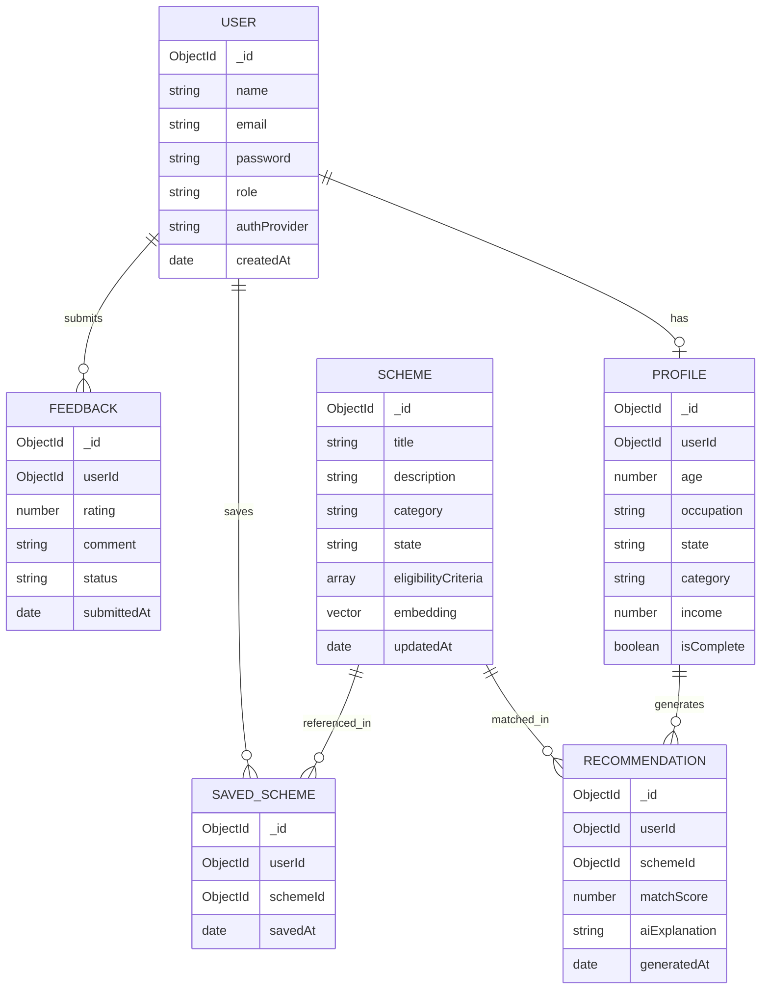

<div align="center">

# 🕌 HaqDar

### AI-Powered Government Scheme Recommendation Platform

Discover the welfare schemes you're actually eligible for — in seconds, not weeks.

[](https://haqdar-web.vercel.app/)
[](https://github.com/MohammadMustafa23/HaqDar-Web-App)
[](#-license)


</div>

---

<details>
<summary>📋 <strong>Table of Contents</strong> (click to expand/collapse)</summary>

- [📖 About the Project](#-about-the-project)
- [❗ Problem Statement](#-problem-statement)
- [💡 Solution](#-solution)
- [✨ Key Features](#-key-features)
- [⚙ How It Works](#-how-it-works)
- [🏗 System Architecture](#-system-architecture)
- [🤖 AI Recommendation Workflow](#-ai-recommendation-workflow)
- [🔐 Authentication Flow](#-authentication-flow)
- [🛠 Admin Panel](#-admin-panel)
- [🗣 Feedback Management](#-feedback-management)
- [🗄 Database Design](#-database-design)
- [⚡ Performance Optimizations](#-performance-optimizations)
- [📂 Project Structure](#-project-structure)
- [⚙ Installation Guide](#-installation-guide)
- [🔑 Environment Variables](#-environment-variables)
- [🌐 API Overview](#-api-overview)
- [🔒 Security](#-security)
- [🚀 Deployment](#-deployment)
- [📈 Future Improvements](#-future-improvements)
- [📚 Challenges & Learnings](#-challenges--learnings)
- [👨‍💻 Developer](#-developer)
- [📄 License](#-license)
- [⭐ Support](#-support)

</details>

---

## 📖 About the Project

**HaqDar** ("the rightful one" / "one entitled to a right") is an AI-powered platform that helps Indian citizens discover **Central and State government welfare schemes** they are actually eligible for. Instead of manually browsing hundreds of scheme portals, users fill out a simple profile once and instantly get **personalized, ranked recommendations** powered by semantic search and AI eligibility matching. It also includes a full **Admin Panel** to manage schemes and a **Feedback Management** system to surface real user reviews on the platform.

🔗 **Try it live:** [haqdar-web.vercel.app](https://haqdar-web.vercel.app/)

## ❗ Problem Statement

- India has **thousands of government welfare schemes**, but awareness and discoverability are extremely poor.
- Citizens, especially in rural and underserved areas, often **miss out on benefits** they qualify for simply because they don't know the scheme exists.
- Existing government portals are **fragmented, non-personalized, and hard to search**, requiring users to already know what they're looking for.
- Scheme data changes frequently, but most portals have **no easy way to keep information up to date**.

## 💡 Solution

HaqDar flips the discovery process — instead of *searching* for schemes, the **schemes find the user**:

1. User fills a one-time eligibility profile (age, income, occupation, state, category, etc.)
2. The profile is converted into an embedding and matched against a **vector database of schemes**
3. Google Gemini re-ranks and explains the **top matching schemes** in plain language
4. Results are cached and saved for instant future access
5. Admins keep the scheme database fresh and accurate through a dedicated **Admin Panel**, including **bulk JSON uploads**

## ✨ Key Features

| Feature | Description |
|---|---|
| 🧠 AI-Powered Matching | Semantic, embedding-based scheme matching — not just keyword filters |
| 📝 One-Time Profile Setup | Fill your profile once, get recommendations forever |
| ⚡ Fast Repeat Access | Redis caching + MongoDB storage for instant reloads |
| 🔐 Secure Auth | JWT + OAuth-based authentication with protected & role-based routes |
| 💬 Scheme Assistant Chatbot | Conversational UI to ask questions about schemes |
| 💾 Save Schemes | Bookmark schemes for later reference |
| 🛠 Admin Scheme Management | Full CRUD control over schemes, plus bulk upload via JSON |
| 🗣 Feedback System | Users submit feedback; admin curates what's shown publicly |
| 📱 Fully Responsive | Optimized for mobile, tablet, and desktop |
| 🦴 Skeleton Loaders | Polished loading states for a smooth UX |

## ⚙ How It Works

```
Sign Up → Complete Eligibility Profile → AI Matches Schemes → View Ranked Results → Save / Explore
```

---

## 🏗 System Architecture



**Layer breakdown:**
- **Client Layer** — separate surfaces for regular users and admins, both built on the same React/Vite codebase with role-gated routes.
- **API Gateway** — a single Express entry point that authenticates, authorizes (user vs admin), and validates every request before it reaches business logic.
- **Backend Services** — cleanly separated services for schemes, profiles, recommendations, and feedback, instead of one monolithic controller.
- **AI/Search Layer** — Pinecone for semantic retrieval, Gemini for reasoning and natural-language explanation.
- **Data Layer** — MongoDB as the system of record, Redis as a low-latency cache in front of expensive recommendation calls.

---

## 🤖 AI Recommendation Workflow



**Flow summary:**
1. User submits their eligibility profile.
2. The profile is transformed into a vector embedding.
3. Pinecone performs semantic similarity search against the schemes database.
4. Gemini re-ranks results and generates human-readable eligibility explanations.
5. Final recommendations are cached (Redis) and persisted (MongoDB) for fast future retrieval.

---

## 🔐 Authentication Flow



---

## 🛠 Admin Panel

A dedicated, role-protected dashboard for platform administrators to manage the entire scheme catalog and user feedback — no manual database edits needed.

**Scheme Management (Full CRUD):**
- ➕ Create a new scheme with full details (title, description, eligibility criteria, category, state)
- 📖 View/search all schemes in a manageable table view
- ✏️ Update existing scheme details
- 🗑 Delete outdated or invalid schemes
- 🔁 On every create/update, the scheme is automatically re-embedded and synced to Pinecone

**Bulk Upload (JSON):**
- 📤 Admins can upload a `.json` file containing multiple schemes at once instead of adding them one by one
- Each record is validated, saved to MongoDB, and embedded into Pinecone in a batch pipeline
- Invalid records are skipped and reported back, so a single bad entry doesn't fail the entire batch

```json
[
  {
    "title": "PM Kisan Samman Nidhi",
    "description": "Income support for small and marginal farmers.",
    "category": "Agriculture",
    "state": "All India",
    "eligibilityCriteria": ["Small/marginal farmer", "Owns cultivable land"]
  },
  {
    "title": "Sukanya Samriddhi Yojana",
    "description": "Savings scheme for the girl child.",
    "category": "Women & Child",
    "state": "All India",
    "eligibilityCriteria": ["Girl child below 10 years", "Indian resident"]
  }
]
```



## 🗣 Feedback Management

Users can submit feedback/reviews about their experience with HaqDar. Rather than showing every submission automatically, admins **curate** what appears publicly — keeping the UI trustworthy and spam-free.

- 📝 Users submit feedback (rating + comments) from their dashboard
- 🗃 All feedback lands in a moderation queue, unpublished by default
- 👨‍💻 Admin reviews feedback in the Admin Panel and **selects which entries to publish**
- ✅ Published feedback appears in a testimonials section on the public UI
- 🚫 Rejected/archived feedback stays hidden but is retained for records



---

## 🗄 Database Design



## ⚡ Performance Optimizations

| Area | Optimization | Impact |
|---|---|---|
| 🔁 **Caching** | Redis caches recommendation results per user profile | Avoids repeat Pinecone + Gemini calls on every visit |
| 🧠 **AI/Search** | Vector search (Pinecone) instead of brute-force filtering | Sub-second semantic matches across thousands of schemes |
| 📦 **Bulk Operations** | Batch embedding + insert pipeline for JSON bulk upload | Hundreds of schemes indexed in one pass instead of one-by-one calls |
| 🧩 **Profile Flow** | One-time profile completion lock | Prevents redundant AI matching runs for the same profile |
| ⚛️ **Frontend State** | Replaced `window.reload()` calls with proper React state updates | Smoother UX, no full page reloads |
| 🦴 **Perceived Speed** | Skeleton loaders on data-heavy views | Reduces perceived wait time during fetches |
| 🗂 **Database** | Indexed fields on `userId`, `schemeId`, `state`, `category` in MongoDB | Faster lookups for profile, saved schemes, and admin queries |

---

## 📂 Project Structure

```
HaqDar-Web-App/
├── client/
│   └── haqdar/                # React + Vite frontend
│       ├── src/
│       │   ├── components/    # Reusable UI components
│       │   ├── pages/         # Route-level pages (user + admin)
│       │   ├── routes/        # Route protection & role-based config
│       │   └── services/      # Axios API layer
│       └── package.json
│
├── server/                    # Node.js + Express backend
│   ├── controllers/           # Route logic (schemes, feedback, admin, auth)
│   ├── models/                # MongoDB schemas
│   ├── routes/                # API route definitions
│   ├── middleware/             # Auth, role-check & validation middleware
│   ├── config/                 # DB, Redis, Pinecone, Gemini configs
│   └── package.json
│
└── README.md
```

## ⚙ Installation Guide

### Prerequisites
- Node.js (v18+)
- MongoDB Atlas account
- Upstash Redis account
- Pinecone account
- Google Gemini API key

### 1. Clone the repository
```bash
git clone https://github.com/MohammadMustafa23/HaqDar-Web-App.git
cd HaqDar-Web-App
```

### 2. Setup the Backend
```bash
cd server
npm install
# create a .env file (see Environment Variables section)
npm run dev
```

### 3. Setup the Frontend
```bash
cd client/haqdar
npm install
npm run dev
```

### 4. Open in browser
```
http://localhost:5173
```

## 🔑 Environment Variables

Create a `.env` file inside the `server/` directory:

| Variable | Description |
|---|---|
| `PORT` | Backend server port |
| `MONGO_URI` | MongoDB connection string |
| `JWT_SECRET` | Secret key for signing JWT tokens |
| `REDIS_URL` | Upstash Redis connection URL |
| `PINECONE_API_KEY` | Pinecone API key |
| `PINECONE_INDEX` | Pinecone index name |
| `GEMINI_API_KEY` | Google Gemini API key |
| `CLIENT_URL` | Frontend URL for CORS config |
| `GOOGLE_CLIENT_ID` | OAuth client ID (if using Google login) |
| `GOOGLE_CLIENT_SECRET` | OAuth client secret |
| `ADMIN_EMAIL` | Bootstrap admin email (optional seed) |

> ⚠️ Never commit your `.env` file. Add it to `.gitignore`.

## 🌐 API Overview

**Public / User Routes**

| Method | Endpoint | Description |
|---|---|---|
| `POST` | `/api/auth/register` | Register a new user |
| `POST` | `/api/auth/login` | Login and receive JWT |
| `POST` | `/api/auth/google` | OAuth login |
| `GET`  | `/api/profile` | Get current user's profile |
| `POST` | `/api/profile` | Submit/update eligibility profile |
| `GET`  | `/api/schemes/recommend` | Get AI-recommended schemes |
| `GET`  | `/api/schemes/:id` | Get details of a specific scheme |
| `POST` | `/api/schemes/save/:id` | Save a scheme to favorites |
| `GET`  | `/api/schemes/saved` | Get all saved schemes |
| `POST` | `/api/feedback` | Submit feedback |
| `GET`  | `/api/feedback/published` | Get all publicly approved feedback |

**Admin Routes** *(role: admin required)*

| Method | Endpoint | Description |
|---|---|---|
| `POST` | `/api/admin/schemes` | Create a new scheme |
| `GET`  | `/api/admin/schemes` | List all schemes (admin view) |
| `PUT`  | `/api/admin/schemes/:id` | Update a scheme |
| `DELETE` | `/api/admin/schemes/:id` | Delete a scheme |
| `POST` | `/api/admin/schemes/bulk-upload` | Bulk upload schemes via JSON file |
| `GET`  | `/api/admin/feedback` | Get all feedback (pending/published/archived) |
| `PATCH` | `/api/admin/feedback/:id/publish` | Approve & publish feedback to public UI |
| `PATCH` | `/api/admin/feedback/:id/archive` | Reject/hide feedback |
| `DELETE` | `/api/admin/feedback/:id` | Permanently delete feedback |

> 📌 Full endpoint documentation coming soon — see [Future Improvements](#-future-improvements).

## 🔒 Security

- Passwords hashed before storage (never stored in plain text).
- JWT-based stateless authentication with **role-based access control** (user vs admin) on every protected route.
- Admin-only routes are double-guarded: JWT verification + role check middleware.
- Environment secrets isolated via `.env` and excluded from version control.
- Input validation on both frontend and backend for auth, profile, scheme, and feedback forms.
- Bulk upload endpoint validates each JSON record individually to prevent malformed/malicious payloads from corrupting the database.
- CORS restricted to trusted frontend origin(s).

## 🚀 Deployment

| Layer | Platform |
|---|---|
| Frontend | [Vercel](https://vercel.com/) |
| Backend | Node.js hosting (e.g. Render / Railway) |
| Database | MongoDB Atlas |
| Cache | Upstash Redis |
| Vector DB | Pinecone |

**Live App:** [haqdar-web.vercel.app](https://haqdar-web.vercel.app/)

## 📈 Future Improvements

- [ ] Multi-language support for regional accessibility
- [ ] Document upload for automated eligibility verification
- [ ] Analytics dashboard for admins (most-matched schemes, drop-off points)
- [ ] SMS/WhatsApp notifications for new matching schemes
- [ ] Full public API documentation (Swagger/Postman)
- [ ] Offline-first PWA support for low-connectivity areas
- [ ] Audit log for admin actions (who created/edited/deleted what)
- [ ] Pagination & filtering on the admin scheme table for large datasets

## 📚 Challenges & Learnings

Building HaqDar involved solving real-world problems beyond just CRUD operations:

- **Semantic matching over keyword search** — learned to design and query a vector database (Pinecone) for meaningful eligibility matches instead of rigid filters.
- **State management pitfalls** — initially relied on `window.reload()` for UI updates, which caused poor UX; refactored to proper React state handling.
- **Data pipeline design** — built the flow `Profile → Pinecone (Top Match) → MongoDB` to balance speed (cache/vector search) with persistence.
- **Bulk data integrity** — designed the bulk JSON upload so a single malformed scheme entry doesn't break the entire batch, with per-record validation and error reporting.
- **Content moderation** — built a feedback approval workflow so admins control what social proof appears publicly, instead of trusting unmoderated submissions.
- **Auth edge cases** — handled OAuth alongside traditional auth, and secured both user and admin routes with role-based checks.
- **Sourcing verified scheme data** — manually curated and structured real scheme data for reliable AI grounding.

## 👨‍💻 Developer

**Mohammad Mustafa**

🔗 LinkedIn: *[add your LinkedIn profile link here]*
🔗 GitHub: [github.com/MohammadMustafa23](https://github.com/MohammadMustafa23)

## 📄 License

This project was built as a **personal/academic project** by Mohammad Mustafa. All rights reserved unless otherwise stated. If you'd like to reuse or build upon this project, please reach out to the developer first.

## ⭐ Support

If you found this project useful or interesting, consider giving it a **star** on GitHub — it helps a lot and motivates further development!

👉 [github.com/MohammadMustafa23/HaqDar-Web-App](https://github.com/MohammadMustafa23/HaqDar-Web-App)

---

Made with ❤️ by [Mohammad Mustafa](https://github.com/MohammadMustafa23)
